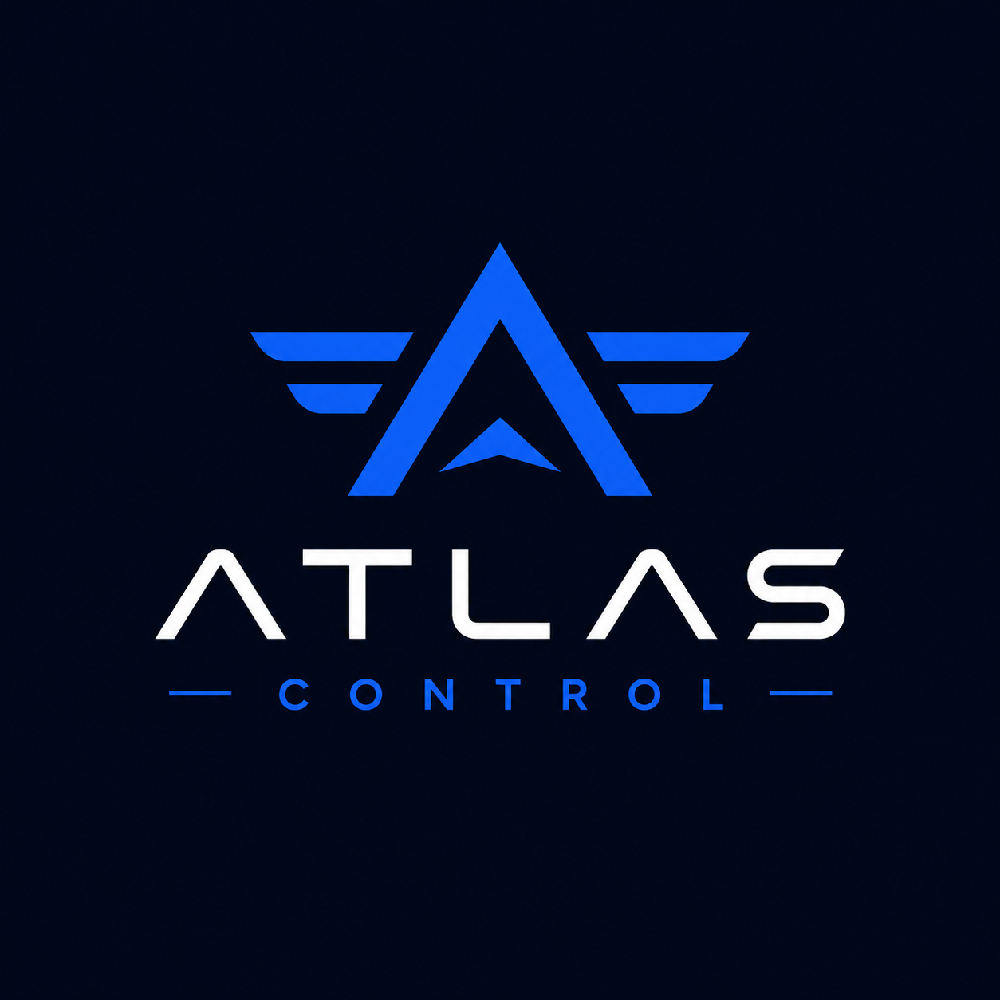

# ATLAS CONTROL - Sistema de Gestão de Estoque

<p align="center">
  
</p>

<p align="center">
  <strong>Sistema moderno de gestão de estoque, clientes e vendas</strong>
</p>

[](https://python.org)
[](https://fastapi.tiangolo.com)
[](https://reactjs.org)
[](https://vitejs.dev)
[](https://www.sqlite.org)
[](https://dotnet.microsoft.com/pt-br/)
[](LICENSE)

ATLAS CONTROL é um Sistema completo e moderno de **gestão de estoque**, desenvolvido para otimizar o controle de produtos, clientes e vendas, proporcionando métricas em tempo real e insights valiosos para tomada de decisões estratégicas.

---

## 📋 Índice

- [🎯 Sobre o Projeto](#-sobre-o-projeto)
- [🚀 Funcionalidades](#-funcionalidades)
- [🛠️ Tecnologias](#-tecnologias)
- [📦 Pré-requisitos](#-pré-requisitos)
- [🔧 Instalação e Configuração](#-instalação-e-configuração)
- [📁 Estrutura do Projeto](#-estrutura-do-projeto)
- [📖 Documentação](#-documentação)
- [🎨 Design e UX](#-design-e-ux)
- [📄 Licença](#-licença)

---

## 🎯 Sobre o Projeto

O **ATLAS CONTROL** é uma solução moderna, intuitiva e escalável para gerenciamento de estoque, com foco em **usabilidade, performance e eficiência operacional**.

A aplicação permite o controle completo do ciclo de vendas, desde o cadastro de produtos até a geração de relatórios financeiros e análises de desempenho em tempo real.

### ✨ Destaques

- 🖥️ Interface responsiva, moderna e intuitiva  
- 📊 Dashboard com KPIs e métricas em tempo real  
- 🔐 Autenticação de usuários (segurança integrada)  
- 📱 Compatível com dispositivos móveis (100% responsivo)  
- 🚀 API RESTful rápida e eficiente  
- 💾 Banco SQLite (com fácil migração para PostgreSQL/MySQL)  
- 📈 Gráficos e relatórios financeiros avançados
- 🔍 Busca e filtros otimizados
- ⚡ Performance otimizada e leve  

---

## 🚀 Funcionalidades

### 📊 Dashboard Gerencial
- **KPIs principais**: Total de produtos, vendas, lucro e margem
- **Gráficos de desempenho**: Análise visual de tendências
- **Alertas de estoque**: Notificações de produtos com baixo estoque
- **Métricas em tempo real**: Atualização instantânea de dados

### 📦 Gestão de Produtos
- Cadastro completo de produtos com categorias
- Controle de entrada e saída de estoque
- Cálculo automático de lucro e margem
- Busca e filtros avançados por categoria
- Gestão de preços (custo e venda)
- Rastreamento de movimentação

### 👥 Controle de Clientes
- Cadastro de Pessoa Física (PF) e Pessoa Jurídica (PJ)
- Histórico completo de compras por cliente
- Informações detalhadas de contato
- Segmentação e análise de clientes

### 💰 Registro de Vendas
- Processo de venda simplificado e intuitivo
- Cálculo automático de totais e impostos
- Geração de comprovantes e recibos
- Relatórios financeiros detalhados
- Histórico e rastreabilidade de transações

### 📋 Relatórios e Exportação
- Relatórios em PDF
- Análise de vendas por período
- Comparativo de performance
- Dados exportáveis para análise externa

---

## 🛠️ Tecnologias

### 🔙 Backend
- **Python 3.8+** - Linguagem de programação
- **FastAPI** - Framework web de alta performance
- **SQLAlchemy** - ORM para manipulação do banco de dados
- **Pydantic** - Validação de dados com type hints
- **Uvicorn** - Servidor ASGI de produção
- **SQLite** - Banco de dados relacional leve

### 🎨 Frontend
- **React 18** - Biblioteca para construção de UI
- **Vite** - Build tool moderno e rápido
- **React Router** - Roteamento na aplicação
- **Chart.js** - Gráficos interativos
- **React ChartJS 2** - Integração do Chart.js com React
- **CSS3** - Estilos modernos e responsivos
- **Axios** - Cliente HTTP para requisições

### ⚙️ Ferramentas e DevOps
- **Git** - Controle de versão
- **npm/yarn** - Gerenciador de pacotes frontend
- **pip** - Gerenciador de pacotes Python
- **.NET/C#** - Microserviço de geração de relatórios

---

## 📦 Pré-requisitos

- Python 3.8+
- Node.js 16+
- .NET 10.0
- npm ou yarn
- Git

---

## 🔧 Instalação e Configuração

### ✅ Pré-requisitos

Antes de começar, certifique-se de ter instalado:
- **Python 3.8+** ([download](https://www.python.org/downloads/))
- **Node.js 16+** ([download](https://nodejs.org/))
- **.NET 10.0** ([download](https://dotnet.microsoft.com/en-us/download))
- **npm ou yarn** (geralmente vem com Node.js)
- **Git** ([download](https://git-scm.com/))

---

### Clone o Repositório

```bash
git clone https://github.com/GxbrielmdaDev/SistemaDeEstoque.git
cd EstoquePIM
```

---

### Configuração do Backend

#### Acesse a pasta do backend:
```bash
cd backend
```

#### Crie e ative um ambiente virtual:

**Windows:**
```bash
python -m venv venv
venv\Scripts\activate
```

**Linux/Mac:**
```bash
python3 -m venv venv
source venv/bin/activate
```

#### Instale as dependências:
```bash
pip install -r requirements.txt
```

#### Inicialize o banco de dados:
```bash
python database/init_db.py
```

#### Inicie o servidor:
```bash
python app.py
```

**Backend disponível em:** [http://localhost:8000](http://localhost:8000)

---

### Configuração do Frontend

#### Em outro terminal, acesse a pasta do frontend:
```bash
cd frontend
```

#### Instale as dependências:
```bash
npm install
```

#### Inicie o servidor de desenvolvimento:
```bash
npm run dev
```

**Frontend disponível em:** [http://localhost:5173](http://localhost:5173)

---

### Scripts Úteis

Na raiz do projeto, use os scripts para facilitar a inicialização:

#### Rodar tudo de uma vez:
```bash
./iniciar.sh
```

#### Limpar o projeto (remover node_modules, .pyc, etc):
```bash
./limpar.sh
```

---

## 📁 Estrutura do Projeto

```
EstoquePIM/
│
├── backend/                          # API REST (FastAPI)
│   ├── app.py                        # Aplicação principal
│   ├── requirements.txt              # Dependências Python
│   │
│   ├── database/
│   │   ├── connection.py             # Configuração do banco
│   │   └── init_db.py                # Inicialização do banco
│   │
│   ├── models/
│   │   ├── client.py                 # Modelo de Cliente
│   │   ├── product.py                # Modelo de Produto
│   │   └── sale.py                   # Modelo de Venda
│   │
│   └── routes/
│       ├── auth.py                   # Autenticação
│       ├── clients.py                # Endpoints de Clientes
│       ├── products.py               # Endpoints de Produtos
│       └── sales.py                  # Endpoints de Vendas
│
├── frontend/                         # Interface React
│   ├── src/
│   │   ├── components/               # Componentes reutilizáveis
│   │   │   ├── CategoryAutocomplete.jsx
│   │   │   ├── CategoryAutocomplete.css
│   │   │   ├── Charts.jsx
│   │   │   ├── Layout.jsx
│   │   │   ├── Layout.css
│   │   │   ├── RelatoryModal.jsx
│   │   │   └── RelatoryModal.css
│   │   │
│   │   ├── pages/                    # Páginas da aplicação
│   │   │   ├── Dashboard.jsx
│   │   │   ├── Clients.jsx
│   │   │   ├── Products.jsx
│   │   │   ├── Sales.jsx
│   │   │   ├── Login.jsx
│   │   │   └── Login.css
│   │   │
│   │   ├── contexts/                 # Contextos React
│   │   │   └── ThemeContext.jsx
│   │   │
│   │   ├── services/                 # Serviços/APIs
│   │   │   └── api.js
│   │   │
│   │   ├── App.jsx                   # Componente principal
│   │   ├── App.css
│   │   ├── main.jsx
│   │   └── index.css
│   │
│   ├── assets/                       # Imagens e recursos
│   │   └── Atlas-Control-logo.png
│   │
│   ├── package.json
│   ├── vite.config.js
│   └── index.html
│
├── relatorio-service/                # Microserviço de Relatórios (.NET/C#)
│   ├── Program.cs
│   ├── appsettings.json
│   ├── relatorio-service.csproj
│   │
│   ├── Controllers/
│   │   └── RelatoriosController.cs
│   │
│   └── Services/
│       └── PdfGenerator.cs
│
├── docs/                             # Documentação
│   ├── API.md                        # Documentação da API REST
│   ├── BancoDeDados.md               # Documentação do banco
│   └── GRAFICOS.md                   # Documentação de gráficos
│
├── arquitetura.md                    # Arquitetura do sistema
├── iniciar.sh                        # Script para iniciar tudo
├── limpar.sh                         # Script para limpar o projeto
└── README.md                         # Este arquivo
```

---

## 📖 Documentação

Documentação detalhada do projeto:

- 📌 **[Documentação da API REST](./docs/API.md)** - Endpoints, parâmetros e exemplos
- 📌 **[Documentação do Banco de Dados](./docs/BancoDeDados.md)** - Schema, tabelas e relacionamentos
- 📌 **[Documentação de Gráficos](./docs/GRAFICOS.md)** - Tipos e configurações de gráficos
- 📌 **[Arquitetura do Sistema](./arquitetura.md)** - Diagrama e padrões arquiteturais

---

## 🎨 Design e UX

### Paleta de Cores

| Uso | Cor | Código |
|-----|-----|--------|
| Primária | 🔴 Vermelho | `#DC2626` |
| Secundária | ⚪ Branco | `#FFFFFF` |
| Texto | ⚫ Cinza Escuro | `#1F2937` |
| Sucesso | 🟢 Verde | `#10B981` |
| Aviso | 🟠 Laranja | `#F59E0B` |
| Erro | 🔴 Vermelho Escuro | `#EF4444` |

### Princípios de Design

- ✨ **Minimalista** - Interface limpa e sem poluição visual
- 📱 **Responsivo** - Funciona perfeitamente em todos os dispositivos
- ♿ **Acessível** - WCAG 2.1 AA compliance
- 🎯 **Consistente** - Padrões visuais e de UX uniformes
- ⚡ **Performático** - Carregamento rápido e fluido
- 🌙 **User-Friendly** - Fácil de usar e aprender

---

## 📄 Licença

Este projeto está distribuído sob a licença **MIT**


---


### Desenvolvedor

**Gabriel Almeida**

- 🐙 GitHub: [@GxbrielmdaDev](https://github.com/GxbrielmdaDev)
- 💼 LinkedIn: [Gabriel Almeida](www.linkedin.com/in/gabriellmdadev)


---

## 🎓 Sobre o Projeto

Este projeto foi desenvolvido como trabalho de **Projeto Integrado Multidisciplinar (PIM)** e demonstra a aplicação prática de conceitos de desenvolvimento full-stack, incluindo:

- Arquitetura em camadas
- API REST
- Banco de dados relacional
- Interface responsiva
- Boas práticas de código
- Documentação técnica

